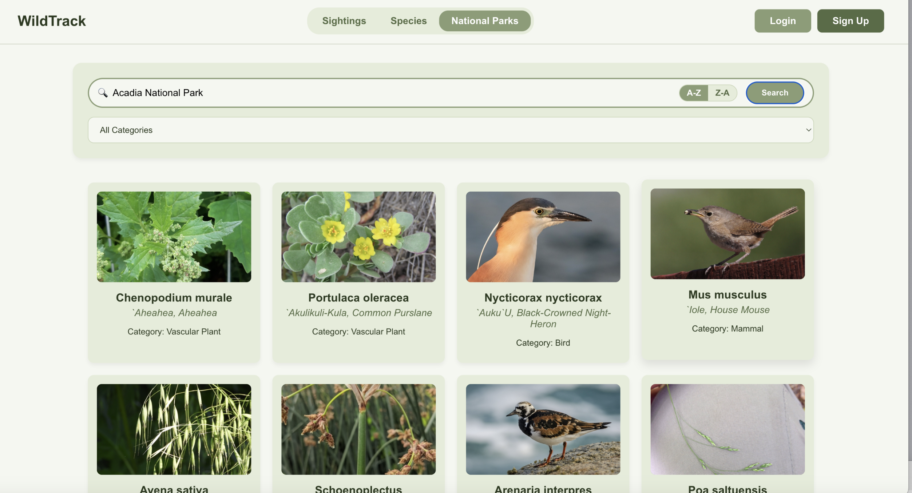
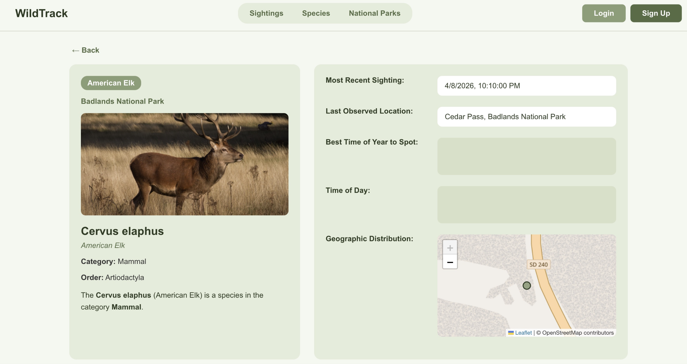

# National Park Species Tracking and Sharing Platform

This project is a full-stack web application designed to provide a platform for nature enthusiasts to look up species information within U.S. National Parks, share their own wildlife sighting records, and explore these records through an interactive map.

<!-- Insert application screenshot here -->
<!-- e.g.,  -->


## Core Features

1.  **Species Information Query**:
    *   Users can search for species by their common or scientific names.
    *   Supports filtering by species category (e.g., mammals, birds, reptiles) and the national park they inhabit.
    *   Provides detailed information about species, including images, descriptions, and a list of national parks where they can be found.

2.  **User-Uploaded Sighting Records**:
    *   Registered users can upload their own wildlife sighting records.
    *   Uploads include the species, a photo, a description, and the geographical location of the sighting.
    *   Image files are stored in Google Cloud Storage to optimize performance and scalability.

3.  **Interactive Map**:
    *   Displays all user-submitted sighting records in real-time on a map.
    *   Users can click on markers on the map to view details of that sighting, such as the species photo, name, and the user who found it.
    *   Provides an intuitive way for users to explore the distribution of species in different areas.

<!-- Insert map feature screenshot here -->
<!-- e.g.,  -->

## Tech Stack and Architecture

This project uses a decoupled front-end and back-end architecture.

### Frontend

*   **Framework**: [React](https://reactjs.org/)
*   **Routing**: [React Router](https://reactrouter.com/)
*   **Core Libraries**:
    *   `axios` for communicating with the back-end API.
    *   A mapping library (like [Google Maps API](https://developers.google.com/maps), [Mapbox](https://www.mapbox.com/), or [Leaflet.js](https://leafletjs.com/)) is used to render the interactive map.
*   **Deployment**: The front-end application can be built into static files and deployed on any static website hosting service.

### Backend

*   **Framework**: [Node.js](https://nodejs.org/) with [Express](https://expressjs.com/)
*   **Language**: [TypeScript](https://www.typescriptlang.org/)
*   **Database**: [MySQL](https://www.mysql.com/) (hosted on Google Cloud SQL)
*   **Core Libraries**:
    *   `mysql2/promise` for asynchronous interaction with the MySQL database.
    *   `@google-cloud/storage` for storing user-uploaded images to Google Cloud Storage.
    *   `bcrypt` for hashing user passwords to ensure account security.
    *   `dotenv` for managing environment variables to securely configure database and cloud service connections.

## File Structure Explained

```
/
├── frontend/           # React Frontend Application
│   ├── public/
│   └── src/
│       ├── components/ # Reusable React components
│       ├── pages/      # Main pages of the application
│       ├── services/   # Services for communicating with the backend API
│       ├── App.js
│       └── index.js
├── server/             # Node.js/Express Backend Service
│   ├── keys/           # (Optional) Google Cloud service account keys
│   ├── src/
│   │   ├── models/     # Data model definitions (TypeScript interfaces)
│   │   ├── routes/     # API route handling
│   │   └── services/   # Core services like database connection, cloud storage, etc.
│   ├── index.ts        # Server entry file
│   └── tsconfig.json
└── README.md
```

## Database and Google Cloud Integration

### Database Design

The back-end service connects to a MySQL database hosted on **Google Cloud SQL**. The core table structure of the database is as follows:

*   `Users`: Stores user information (ID, Username, Password).
*   `Species`: Stores detailed information about species.
*   `NationalParks`: Stores information about national parks.
*   `ParkSpecies`: A join table that connects `Species` and `NationalParks`.
*   `Sightings`: Stores user sighting records, including references to species, users, and locations.
*   `Locations`: Stores the geographical location information (latitude, longitude) of sighting records.

### Local Development and Cloud Connection

In a local development environment, the back-end service reads database connection information from a `.env` file. These variables include:

*   `DB_HOST`: The IP address of the Google Cloud SQL instance.
*   `DB_USER`: The database username.
*   `DB_PASSWORD`: The database password.
*   `DB_NAME`: The database name.

This approach allows the development environment to seamlessly connect to the cloud database instance while avoiding hard-coding sensitive credentials in the code.

### Google Cloud Storage

User-uploaded images are not stored directly in the database. The back-end service uses the `@google-cloud/storage` library to upload images to a bucket in **Google Cloud Storage (GCS)**. After a successful upload, only the public URL of the image is stored in the `Sightings` table in the database. This design has several benefits:

*   **Reduces Database Load**: Avoids storing large binary files in the database.
*   **High-Performance Access**: Images are distributed through Google's global CDN for faster loading.
*   **Easy to Scale**: GCS can store massive amounts of files and is highly scalable.

---

*This README was generated with the assistance of Gemini.*
